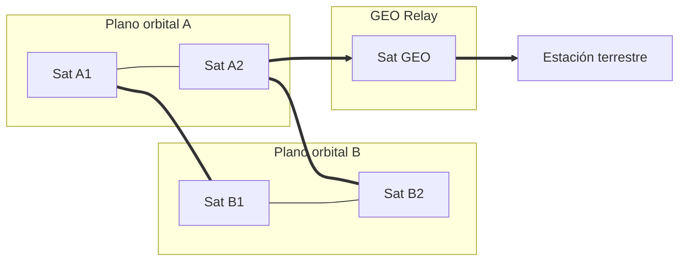

# Comunicación entre satélites (Inter‑Satellite Links, ISL)

> Estado del arte práctico para equipos que quieran diseñar, integrar o evaluar enlaces inter‑satélite.

---

## 1) Qué es y para qué sirve

Las ISL permiten que dos satélites se comuniquen directamente sin pasar por estaciones en tierra. Al crear mallas en órbita (especialmente en LEO):

* Reducen latencia extremo‑a‑extremo.
* Mantienen conectividad en zonas sin gateways (océanos, polos).
* Descongestionan espectro y tramas en el segmento terreno.
* Permiten “store‑and‑forward” y routing espacial sin dependencia constante del suelo.

**Casos de uso**: mega‑constelaciones (backbone LEO‑LEO), relés de datos LEO→GEO (downlink casi en tiempo real), operaciones lunares/planetarias con tolerancia a interrupciones.

---

## 2) Tecnologías principales

### RF (microondas)

* **Pros**: tecnología madura; interoperabilidad sólida; apuntado menos exigente; buen desempeño en escenarios dinámicos.
* **Contras**: menor caudal por Hz; uso de espectro licenciado/coord. ITU; antenas y RF chains más voluminosos.
* **Dónde encaja**: proximidad, misiones con jitter/plataformas modestas, redundancia a óptica.

### Óptica (láser)

* **Pros**: muy alto caudal (decenas‑cientos Gbps); inmunidad a interferencias RF; sin licencia de espectro entre satélites; terminales compactos.
* **Contras**: requiere **PAT** (Pointing, Acquisition and Tracking) muy fino; control térmico/estructural y sincronización estrictos; sensibilidad a desalineación y contaminación óptica.
* **Dónde encaja**: mallas LEO‑LEO de alto rendimiento, relés EDRS‑like, backbone de transporte.

> **Híbrido**: RF para adquisición/backup + óptica para datos masivos.

---

## 3) Estándares y pila de protocolos

### Capas física/enlace (CCSDS)

* **Proximity‑1**: enlaces de cercanía (orbiter‑orbiter / orbiter‑rover).
* **USLP (Unified Space Data Link Protocol)**: evolución de alto rendimiento para espacio‑espacio y espacio‑tierra.
* **Óptica CCSDS (HDR 1064/1550 nm)**: define adquisición, apuntado, codificación y sincronización para terminales láser.

### Perfiles de interoperabilidad

* **SDA OCT/OISL** (Space Development Agency, EE. UU.): perfiles abiertos de terminales ópticos para interoperar entre proveedores (interfaces, FEC, PAT, seguridad, telemetría).

### Red/Transporte tolerante a interrupciones

* **DTN / Bundle Protocol v7 (BPv7)** con **BPSec** (seguridad E2E), **LTP** para transporte espacial y **Contact Graph Routing (CGR)** para ruteo por contactos conocidos.
* Implementaciones: **ION (JPL/NASA)**, **HDTN (NASA Glenn)**.

```
Capa App     : Telemetría/Telecomandos, cargas útiles, files
Capa Red     : DTN (BPv7 + BPSec)  | IPv6 opcional intra‑satélite
Capa Enlace  : USLP / Proximity‑1 / Óptica CCSDS (tramas, FEC)
Capa Física  : RF (S/X/Ka, etc.) o Láser (1064/1550 nm)
```

---

## 4) Actores, programas y hardware

* **Mega‑constelaciones**: Starlink (ISL ópticos ~100–200 Gbps); Kuiper/OneWeb en evolución hacia ISL.
* **Relés GEO**: **EDRS (SpaceDataHighway)** de Airbus/ESA para LEO↔GEO vía láser.
* **Demostradores NASA/ESA**: LCRD/LCOT/TBIRD (downlinks ópticos récord y madurez PAT), misiones Proba‑V/EDRS.
* **Vendors de terminales ópticos**: Mynaric (CONDOR Mk2/Mk3), CACI, Tesat, etc.

---

## 5) Retos técnicos críticos

1. **PAT (Pointing, Acquisition & Tracking)**: haces muy estrechos ⇒ búsqueda temporal/espacial coordinada; requisitos de jitter, estabilidad térmica y modelado de error de apuntamiento.
2. **Dinámica LEO‑LEO**: altas velocidades relativas ⇒ **Doppler**, ventanas de visibilidad cortas y topologías cambiantes ⇒ demanda **CGR** y planificación de contactos.
3. **Rendimiento extremo**: tasas 100–200 Gbps ⇒ **FEC** (LDPC), control de jitter/latencia, buffers para “store‑and‑forward”.
4. **Entorno espacial**: ciclos térmicos, radiación, contaminación de ópticas, outgassing.
5. **Interoperabilidad multi‑proveedor**: perfilar contra **SDA OCT**/CCSDS para enlaces mixtos.
6. **Seguridad y resiliencia**: cifrado en enlace y **BPSec** E2E; hardening de OBC/red; anti‑jamming (en RF).
7. **Regulación/espectro**: RF requiere coordinación ITU; en óptica considerar seguridad ocular, coexistencia con otros instrumentos y normas de exportación.

---

## 6) Arquitecturas típicas

### Malla LEO‑LEO con ISL ópticos

* 2‑4 enlaces por satélite (in‑plane y cross‑plane) ⇒ backbone en órbita, mínima dependencia de gateways.

### LEO↔GEO (relay láser)

* LEO sube datos a un GEO “data relay” y éste hace downlink a múltiples estaciones (casi tiempo real y mejor cobertura).

### Esquema (Mermaid)



---

## 7) Stack de trabajo recomendado (práctico)

**Normativa/base técnica**

* USLP/Proximity‑1 para enlace; Óptica CCSDS HDR para láser; perfilar contra SDA OCT si se requiere interoperabilidad.

**Red y software**

* DTN (BPv7 + BPSec); CGR para planificación; ION/HDTN en el OBC; TM/TC bajo CCSDS.

**Simulación y pruebas**

* Planificación de contactos; emulación de Doppler/fading; bancadas con generadores de tramas CCSDS (p. ej., YAMCS) y terminales de laboratorio.

**Hardware de referencia**

* Terminales ópticos COTS (Mynaric CONDOR, Tesat, etc.) con PAT integrado; radios SDR para RF (S/X/Ka) con modems compatibles USLP.

---

## 8) Roadmap de implantación (paso a paso)

1. **Requisitos**: órbita, geometría, caudal/latencia, SNR y presupuesto de enlace.
2. **Elección tecnológica**: RF vs. óptica (o híbrido) según pointing/potencia/presupuesto.
3. **Estándares**: USLP/Proximity‑1 + Óptica CCSDS; alinear con SDA OCT si aplica.
4. **Red tolerante a interrupciones**: BPv7 + BPSec; CGR; telemetría/telecomandos integrados.
5. **PAT y térmico**: cierres de presupuesto fotónico, jitter de plataforma, secuencias de adquisición.
6. **Banco de pruebas**: FEC, latencias, resiliencia (degradados, pérdida de contacto); campañas HIL/SIL.
7. **Validación on‑orbit**: pilotos con terminales COTS; monitorizar KPIs (BER, throughput, availability, contact success rate).

---

## 9) Checklist de requisitos (copiable)

* [ ] **Órbita y geometría** definidas (LEO/MEO/GEO, planos y cruces).
* [ ] **Tecnología de enlace**: RF / Óptica / Híbrida.
* [ ] **Estándares**: USLP / Proximity‑1 / Óptica CCSDS; perfil **SDA OCT** si aplica.
* [ ] **Capa de red**: DTN (BPv7 + BPSec), CGR configurado.
* [ ] **Terminal**: presupuesto de potencia, PAT (adquisición, tracking), FEC (LDPC), reloj/PLL.
* [ ] **OBC/Software**: ION/HDTN, TM/TC, logging, actualización segura.
* [ ] **Seguridad**: cifrado en enlace y E2E; hardening; supply‑chain y secure boot.
* [ ] **Regulación**: coordinación ITU (RF), requisitos de seguridad óptica y export control.
* [ ] **Pruebas**: HIL/SIL, enlace cierre a temperatura, vibración, radiación; KPIs definidos.
* [ ] **Operaciones**: planificación de contactos, mantenimiento, telemetría de salud del enlace.

---

## 10) Lecturas y referencias sugeridas (para ampliar)

* Documentación CCSDS (USLP, Proximity‑1, Optical Communications).
* RFC 9171 (Bundle Protocol v7), BPSec.
* Publicaciones de NASA/ESA sobre LCRD, LCOT, TBIRD y EDRS.
* Especificaciones públicas de SDA OCT/OISL.
* Data‑sheets de terminales ópticos (Mynaric, Tesat, CACI).

---

## 11) Glosario mínimo

* **ISL**: Inter‑Satellite Link.
* **PAT**: Pointing, Acquisition & Tracking.
* **DTN / BPv7**: Red tolerante a retardos/ interrupciones; Bundle Protocol v7.
* **USLP**: Unified Space Data Link Protocol (CCSDS).
* **CGR**: Contact Graph Routing (ruteo por ventanas de visibilidad conocidas).
* **FEC/LDPC**: Corrección de errores (Forward Error Correction / Low‑Density Parity‑Check).
